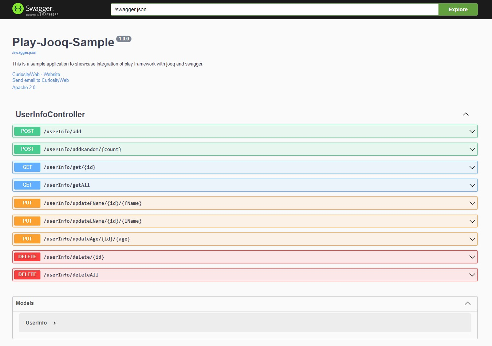

# play-jooq-sample

This is a proof-of-concept for integrating the Play framework with Jooq; in this example, we're using Jooq Codegen to generate Scala classes and the Jooq library to perform curd operations on the h2 database.

## How to run?

To run this project:-

    sbt clean compile run

And then browse the url: [localhost:9000](http://localhost:9000)

## Libraries/Tools/Frameworks Used

 - https://www.scala-lang.org/
 - https://www.playframework.com/
 - https://www.jooq.org/

## Project Images

